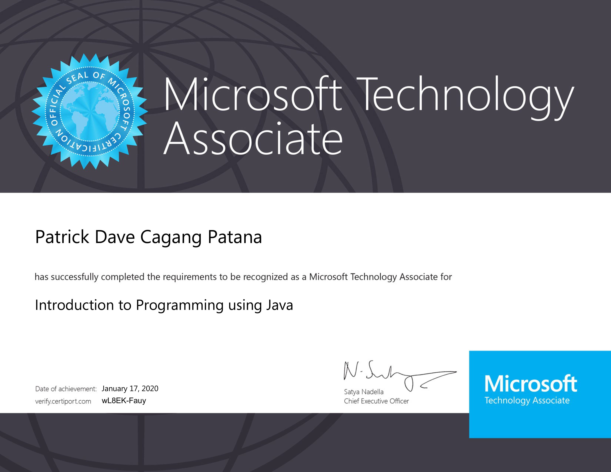
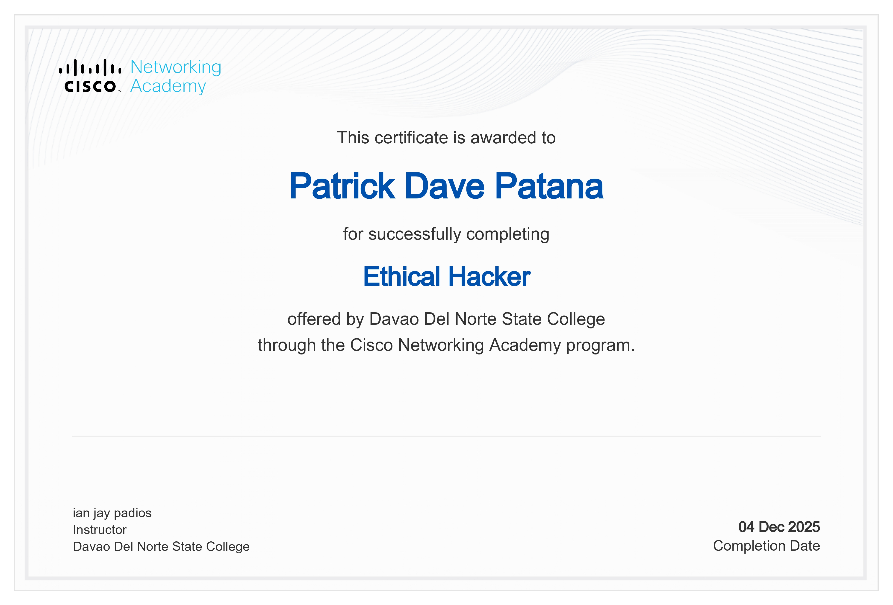
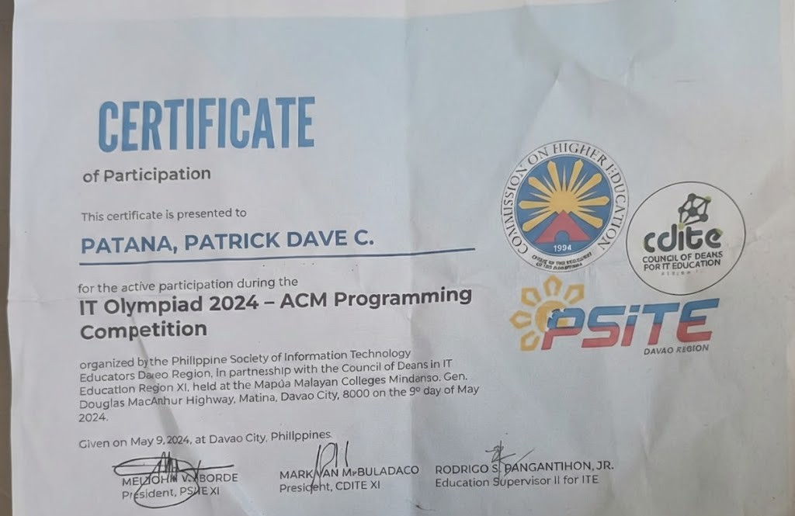
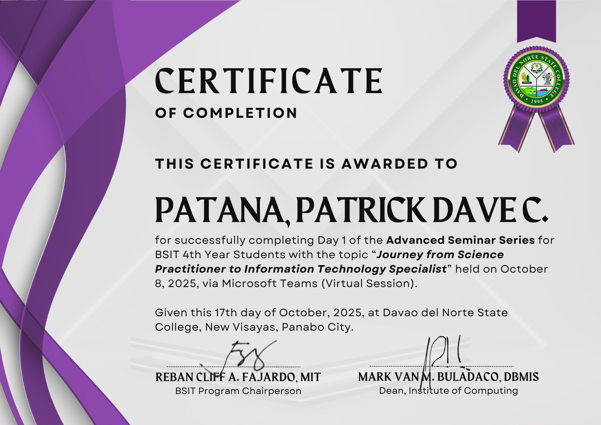
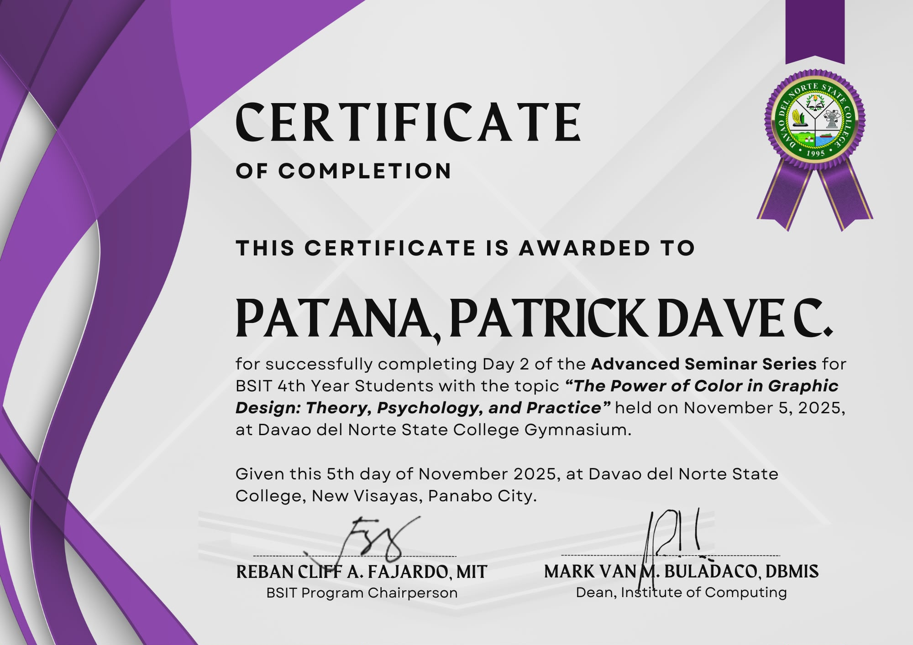

# Hi, I am Patrick Dave Patana  
*Full Stack Developer | Graduating BSIT Student - Davao del Norte State College*

---

### 🚀 Tech Stack

### 🎨 Frontend & Frameworks
<table>
  <tr>
    <td align="center"> Next.js</td>
    <td align="center"> React.js</td>
    <td align="center"> Vue.js</td>
    <td align="center"> Tailwind</td>
    <td align="center"> Bootstrap</td>
    <td align="center"> HTML5</td>
    <td align="center"> CSS3</td>
  </tr>
</table>

---

### ⚙️ Backend & Database
<table>
  <tr>
    <td align="center"> Django</td>
    <td align="center"> PostgreSQL</td>
    <td align="center"> MySQL</td>
  </tr>
</table>

---

### 💻 Languages
<table>
  <tr>
    <td align="center"> JavaScript</td>
    <td align="center"> Python</td>
    <td align="center"> Java</td>
    <td align="center"> PHP</td>
    <td align="center"> C++</td>
  </tr>
</table>

---

### 🐳 Tools & DevOps
<table>
  <tr>
    <td align="center"> Docker</td>
    <td align="center"> Git</td>
  </tr>
</table>

---

### 📜 Certificates & Achievements

#### Microsoft Certified – Java Programming  

#### Cisco Certified – Ethical Hacking  

#### IT Olympiad 2024 - ACM Programming Competition

#### Advanced Seminar Series - IT Specialist & Design

